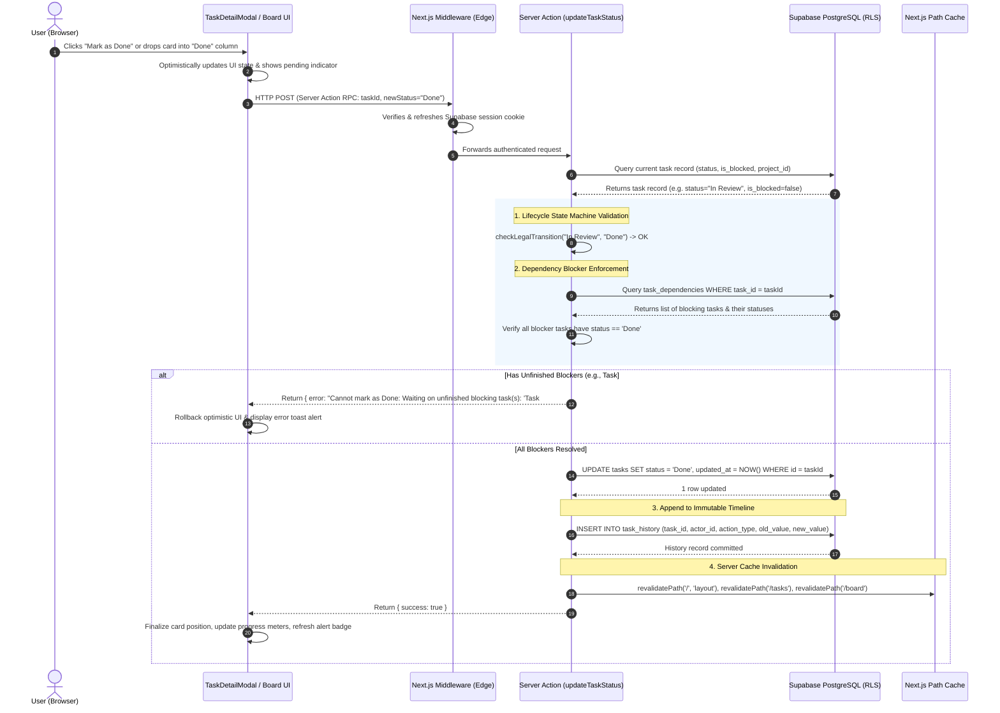

# System Architecture — Busy (Project & Task Tracking)

## 1. Executive Summary & Architectural Overview

**Busy** is an enterprise-grade, multi-tenant project and task management system built specifically for services companies managing multiple client deliverables concurrently. The system is engineered around four foundational architectural tenets:
1. **Server-Authoritative Business Logic & Security**: Client-side validations serve strictly as UX enhancements; all role permissions, state machine transitions, dependency constraints, and data mutations are strictly validated and enforced on the server and at the database kernel level via PostgreSQL Row Level Security (RLS).
2. **Relational Integrity with Graph Dependency Engine**: Task blocking relationships form a directed acyclic graph (DAG) within each project. The architecture incorporates cycle detection algorithms to prevent circular deadlocks across dependency chains of arbitrary depth.
3. **Immutable, Append-Only Audit Trail**: Every state transition, field mutation, assignment, worklog, and discussion comment is recorded into an append-only ledger (`task_history`) protected by database-level policies prohibiting updates and deletions.
4. **Zero-Overhead Serverless & Cloud-Native Topology**: The application runs entirely on modern serverless compute (Next.js 16 App Router on Vercel) backed by a managed PostgreSQL instance (Supabase), eliminating stateful daemon management while remaining 100% compliant with free-tier operational constraints.

---

## 2. System Topology & Component Interactions

```
 +-------------------------------------------------------------------------------+
 |                           CLIENT TIER (Web Browser)                           |
 |  - React 19 Hydrated Components (Kanban Board, Task Table, Modals, Charts)    |
 |  - Keyboard Shortcut Subsystem & Command Palette (g+d, g+t, g+b, c, ?)        |
 |  - URL SearchParams State Engine (Search, Filter, Sort, Pagination)           |
 +---------------------------------------+---------------------------------------+
                                         |
                       HTTPS / JSON RPC  |  Next.js Server Actions
                                         v
 +-------------------------------------------------------------------------------+
 |                       COMPUTE TIER (Next.js 16 App Router)                    |
 |                                                                               |
 |  [ Edge / Node Middleware (src/middleware.ts & src/utils/supabase/middleware) ]|
 |   - Intercepts requests, decrypts HTTP-only cookies, refreshes JWT sessions   |
 |   - Enforces route guardrails (redirects unauthenticated users to /login)     |
 |                                                                               |
 |  [ React Server Components (RSC) ]                                            |
 |   - Fetches data directly on server via @supabase/ssr                         |
 |   - Streams zero-JS HTML & RSC payloads directly to browser                   |
 |                                                                               |
 |  [ Server Action Controllers (src/app/actions/*) ]                            |
 |   - taskActions.ts: Task lifecycle state machine, validation, CRUD            |
 |   - bulkActions.ts: Multi-task batch mutations with granular error reporting  |
 |   - projectActions.ts: Project management & server-side role verification     |
 |   - dependencyActions.ts: DAG cycle detection & transitive dependency audit   |
 |   - timeTrackingActions.ts: Worklog parsing & estimate calculation            |
 |   - alertActions.ts: Overdue task dismissal & revival lifecycle               |
 |   - digestActions.ts & api/digest: HTML overdue task email digest generation  |
 +---------------------------------------+---------------------------------------+
                                         |
             PostgREST / Postgres Wire   |  @supabase/ssr (Scoped Session Token)
                                         v
 +-------------------------------------------------------------------------------+
 |                         DATA TIER (Supabase Cloud PostgreSQL)                 |
 |                                                                               |
 |  [ Relational Schema ]                                                        |
 |   - profiles, projects, project_members, tasks, task_assignments,             |
 |     task_dependencies, task_history, dismissed_alerts                         |
 |                                                                               |
 |  [ Security & Database Triggers ]                                             |
 |   - Row Level Security (RLS) policies on every table                          |
 |   - is_manager() SECURITY DEFINER helper function                             |
 |   - handle_new_user() trigger on auth.users for profile synchronization       |
 |   - Prohibited UPDATE / DELETE policies on task_history (Immutable audit)     |
 +-------------------------------------------------------------------------------+
```

### 2.1. The Moving Pieces

1. **Frontend Presentation & Interaction Layer (Browser)**
   - **Framework & Runtime**: Built with **React 19** and styled using **Tailwind CSS v4** following an Atlassian Jira-inspired design language (slate blue navigation `#0747A6`, high-contrast status lozenges, compact data grids).
   - **Component Architecture**:
     - *Server Components (`page.tsx`, `layout.tsx`)*: Handle top-level data orchestration, authentication checks, and database querying, shipping minimal JavaScript to the client.
     - *Client Components (`TaskListClient.tsx`, `TaskDetailModal.tsx`, `DashboardCharts.tsx`, `CommandPalette.tsx`)*: Encapsulate interactive behaviors such as optimistic UI toggles, modal dialogs, drag-and-drop Kanban state, Recharts SVG rendering, and @mention popovers.
   - **Navigation & URL-Driven State**: Filter, search, sort, and pagination states are synchronized directly to browser `URLSearchParams` (`?q=...&status=...&priority=...&page=...`). This guarantees that user views are fully bookmarkable, shareable, and refresh-safe without maintaining fragile client-side cache stores.
   - **Keyboard Subsystem**: A centralized `KeyboardShortcutsProvider` listens for global two-key sequences (e.g., `g + d` for Dashboard, `g + t` for Tasks, `g + b` for Board, `c` for Create Task, `?` for Shortcuts Modal), managing keyboard focus traps and avoiding conflicts with form inputs.

2. **Compute & Application Logic Layer (Next.js App Router)**
   - **Edge & Session Middleware (`src/middleware.ts`)**: Executes before every incoming HTTP request. Uses `@supabase/ssr` to validate cryptographic JWT session cookies, automatically refresh near-expiry tokens via Supabase Auth endpoints, and gate protected routes (`/(dashboard)/*`).
   - **Type-Safe RPC via Server Actions (`src/app/actions/*`)**:
     - Eliminates traditional boilerplate REST API controllers and custom fetch wrappers.
     - All mutations are defined as asynchronous `'use server'` functions that extract session cookies securely, enforce role permissions, run domain rule checks, execute database operations, and call `revalidatePath()` to invalidate Next.js route caches.
   - **Domain State Machine Engine**:
     - Enforces legal status transitions (`Backlog → In Progress → In Review → Done`, reopening from `Done`, and blocking toggles from `In Progress` or `In Review`).
     - Directly checks dependencies before permitting a transition to `Done`.
   - **Cycle Detection Engine (`src/lib/dependencyGraphUtils.ts`)**:
     - Builds an in-memory directed graph of project tasks and runs depth-first search (DFS) with recursive backtracking to identify circular chains (e.g., `A → B → C → A`) before any new dependency edge can be inserted into the database.

3. **Data & Persistence Layer (Supabase PostgreSQL)**
   - **Engine**: Managed PostgreSQL 15 running in Supabase Cloud.
   - **Multi-Tenant Data Isolation via Row Level Security (RLS)**:
     - Enforced directly by the database engine.
     - `profiles`: Readable by authenticated users; updateable only by the profile owner.
     - `projects`: Managers have universal read/write access. Regular members can only view non-archived projects they belong to (`project_members`).
     - `tasks`: Accessible only if the user is a manager or belongs to the project. Deletion is strictly reserved for managers (`WITH CHECK (public.is_manager())`).
     - `task_history`: Insertable by authenticated users; readable by project members; **UPDATE and DELETE policies are completely omitted**, making the audit trail immutable even to database administrators without manual superuser intervention.
   - **Database Triggers**:
     - `handle_new_user()`: Executes `AFTER INSERT ON auth.users`, extracting metadata (`role`, `full_name`) and populating `public.profiles` atomically.

---

## 3. Runtime Topology — Where Each Piece Runs

| Component | Runtime Environment | Hosting Provider | Execution Characteristics |
|---|---|---|---|
| **Client UI & DOM** | Modern Web Browser (V8 / JavaScriptCore / Gecko) | Client Device | Handles user events, local state, keyboard shortcuts, DOM rendering, Recharts visualizations, and Framer Motion micro-animations. |
| **Authentication Middleware** | Edge Runtime / Vercel Edge Network | Vercel | Executes globally at the network edge with sub-10ms cold starts to inspect and refresh HTTP-only session cookies. |
| **Server Components & Server Actions** | Node.js Serverless Functions (`nodejs20.x`) | Vercel (or Node container) | Executes server-side rendering, input validation, graph algorithms, and database queries. Stateless and auto-scaling. |
| **Relational Database & Auth Engine** | Managed PostgreSQL 15 + GoTrue Auth | Supabase Cloud (AWS us-east-1) | Houses persistent relational data, connection pooling (Supavisor), database triggers, and Row Level Security evaluation. |
| **Scheduled Digests & Background Triggers** | Serverless API Route (`/api/digest`) | Vercel Cron / External Webhook | Evaluates overdue thresholds across all active projects and generates formatted HTML email digests on demand. |

---

## 4. End-to-End Request Path: Moving a Task to "Done"

The following trace details the complete lifecycle of one of the most critical actions in the system: **a user marking a task as "Done"**, which involves role verification, state machine enforcement, dependency validation, database mutation, immutable audit logging, and cache revalidation.



### Detailed Step-by-Step Breakdown

1. **User Action**: The user clicks the "Done" transition button in `TaskDetailModal` or drags a task card into the "Done" column on the Kanban board.
2. **Client-Side Validation & Dispatch**: The client component initiates a React 19 `useTransition` hook and invokes `updateTaskStatus(taskId, 'Done')`.
3. **HTTP Transport**: The Next.js client runtime packages the function call as an HTTP POST request targeting the Server Action endpoint with serialized arguments.
4. **Edge Authentication Check**: `src/middleware.ts` intercepts the request, reads `sb-access-token` and `sb-refresh-token` from encrypted HTTP-only cookies, validates the JWT with Supabase Auth, and passes the session context downstream.
5. **Server Action Instantiation**: `src/app/actions/taskActions.ts` initializes a server Supabase client (`createClient()`) bound to the current request cookie store.
6. **Caller Identity Verification**: The action calls `supabase.auth.getUser()`. If no valid authenticated session exists, execution immediately terminates with `{ error: 'Not authenticated' }`.
7. **Task State & Blocker Fetch**: The server queries the target task by ID. It verifies:
   - Does the task exist?
   - Is `is_blocked === true`? (If blocked, the move is rejected: the task must be unblocked before moving).
8. **State Machine Enforcement**: `checkLegalTransition(currentStatus, 'Done')` executes. Legal transitions into "Done" are strictly permitted only from `'In Review'`. An illegal attempt (such as jumping directly from `'Backlog'` to `'Done'`) is rejected immediately with an explanatory error message.
9. **Unfinished Blocker Check**: The server queries `task_dependencies` joined with `tasks` on `blocks_task_id`. If any dependent blocking task has a status other than `'Done'`, the action rejects the transition and formats a user-friendly error listing the blocking task titles.
10. **Database Mutation**: Upon passing all validation checks, the server issues an atomic SQL `UPDATE` to change `status` to `'Done'` and set `updated_at` to the current UTC timestamp.
11. **Immutable Audit Logging**: The action inserts a new record into `task_history` capturing `task_id`, `actor_id` (the current user's UUID), `action_type: 'status_change'`, `old_value: 'In Review'`, and `new_value: 'Done'`.
12. **Cache Invalidation & Revalidation**: The action calls `revalidatePath('/', 'layout')`, `revalidatePath('/tasks')`, and `revalidatePath('/board')`, purging cached server components.
13. **Client State Reconciliation**: The browser receives the `{ success: true }` response payload, reconciles the DOM, and updates navigation notification badges (e.g., clearing the task from overdue alerts if it was overdue).

---

## 5. Architectural Trade-offs & What We Decided NOT to Build

In building Busy within the 12-hour engineering budget, every technical choice prioritized **reliability, security, and requirement adherence** over speculative complexity. Below are the major architectural alternatives evaluated and deliberately omitted:

### 5.1. Supabase Realtime (WebSockets) vs. Server Actions + Cache Revalidation
- **What we decided NOT to build**: We decided not to wire persistent WebSocket subscriptions (`supabase.channel().on('postgres_changes')`) across all client views.
- **Rationale**: Realtime WebSockets introduce significant operational overhead: connection pooling exhaustion on serverless platforms, complex client-side merge conflicts (e.g., what happens when two users edit the same task description simultaneously), and memory leaks in long-lived browser sessions.
- **Chosen Approach**: We utilized Next.js Server Actions paired with `revalidatePath()`. Mutations trigger instantaneous server re-rendering and deliver consistent state. For an internal project and task tracker, deterministic consistency on user action provides a vastly superior reliability profile than eventual consistency over WebSockets.

### 5.2. Heavy ORM (Prisma / TypeORM) vs. Direct PostgREST Query Builder
- **What we decided NOT to build**: We rejected adding a heavyweight ORM layer like Prisma or TypeORM.
- **Rationale**: Heavy ORMs introduce substantial cold-start penalties in serverless environments due to large binary query engines. More importantly, ORMs typically connect via a single privileged database connection string, entirely bypassing PostgreSQL Row Level Security (RLS) policies and forcing developers to recreate role-based access control in application memory.
- **Chosen Approach**: We used `@supabase/ssr` with PostgREST. Every database query executes with the authenticated user's scoped JWT, allowing PostgreSQL to enforce security policies natively at the database engine level.

### 5.3. Separate Backend Service (Express / NestJS / FastAPI) vs. Unified Next.js Monolith
- **What we decided NOT to build**: We decided not to decouple the system into a separate frontend repo and backend API service.
- **Rationale**: A decoupled multi-repo architecture requires maintaining dual deployment pipelines, managing CORS headers, configuring cross-domain authentication cookies, and synchronizing duplicated TypeScript interface models between repositories.
- **Chosen Approach**: A unified Next.js 16 App Router application. Server Actions provide a seamless, type-safe RPC boundary where server code and UI components share identical TypeScript definitions, eliminating serialization mismatches and cutting deployment friction to zero.

### 5.4. Client-Side Dataset Filtering vs. Server-Side SQL Filtering
- **What we decided NOT to build**: We strictly avoided fetching the entire project task database into the browser to filter using JavaScript `.filter()`.
- **Rationale**: While client-side filtering is trivial to code for 20 items, it breaks down catastrophically at scale. It wastes client bandwidth, exhausts mobile memory, and violates data boundary guarantees by exposing records to the client before permission filtering occurs.
- **Chosen Approach**: All search (`ILIKE %query%`), project filters, status filters, assignee filters, sorting, and pagination (`limit`, `from`, `to`, `count: 'exact'`) are pushed down to PostgreSQL via SQL queries. The browser receives only the exact page of 10 items requested.

### 5.5. Background Polling Daemon for Overdue Alerts vs. Deterministic Snapshot Revivals
- **What we decided NOT to build**: We decided not to deploy an always-on background worker or Node cron process to continuously poll tasks and update alert flags.
- **Rationale**: Free hosting tiers (Render, Vercel, Supabase) spin down idle servers, meaning background daemons either terminate unpredictably or require paid persistent dynos.
- **Chosen Approach**: Overdue status is evaluated deterministically at query time (`due_date < NOW() AND status != 'Done'`). For alert dismissals, we designed the `dismissed_alerts` table to store `(user_id, task_id, dismissed_due_date)`. When an overdue task's due date is updated, the task's new `due_date` no longer matches `dismissed_due_date`, causing the alert to automatically and instantly reappear without needing a background worker.

### 5.6. Soft Deletes for Tasks vs. Hard Cascading Deletion
- **What we decided NOT to build**: We chose not to implement soft deletion (`is_deleted` flags) for tasks, reserving soft archiving solely for projects (`is_archived`).
- **Rationale**: Soft-deleting tasks creates severe relational integrity hazards in dependency networks: if Task B is blocked by Task A, and Task A is soft-deleted, queries across the graph must constantly filter out soft-deleted blockers, creating phantom dependency deadlocks.
- **Chosen Approach**: When a manager deletes a task, PostgreSQL cascading constraints (`ON DELETE CASCADE`) cleanly prune associated records in `task_assignments` and `task_dependencies`, preserving the integrity of the remaining directed acyclic graph.
