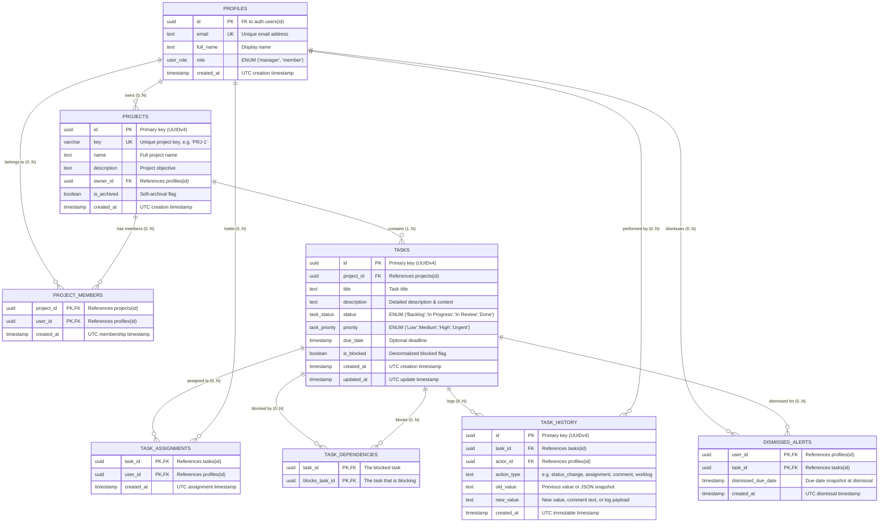

# Database Schema & Data Architecture — Busy

## 1. Executive Summary & Architectural Overview

**Busy** utilizes a relational data model implemented in **PostgreSQL 15** via Supabase. The schema is designed around strict data integrity, role-based multi-tenancy enforced at the database kernel level via Row Level Security (RLS), and an append-only immutable audit log that prevents history rewriting.

The data layer consists of **8 core tables** partitioned logically into four domains:
1. **Identity & Multi-Tenancy**: `profiles`, `projects`, `project_members`
2. **Task & Dependency Graph**: `tasks`, `task_assignments`, `task_dependencies`
3. **Immutable Event Ledger**: `task_history`
4. **Stateful Alert Snapshotting**: `dismissed_alerts`

---

## 2. Entity-Relationship Diagram (ERD)



---

## 3. Detailed Table Specifications & Schema Definitions

### 3.1. Database Extensions & Custom Types (ENUMs)

```sql
-- Extensions
CREATE EXTENSION IF NOT EXISTS "uuid-ossp";

-- Enums
CREATE TYPE user_role AS ENUM ('manager', 'member');
CREATE TYPE task_status AS ENUM ('Backlog', 'In Progress', 'In Review', 'Done');
CREATE TYPE task_priority AS ENUM ('Low', 'Medium', 'High', 'Urgent');
```

---

### 3.2. Table Breakdown

#### 1. `profiles`
Stores user profile information, role classification, and acts as the public mirror of Supabase's internal `auth.users` table.

| Column | Type | Nullable | Default | Constraints | Description |
|---|---|---|---|---|---|
| `id` | `UUID` | **NO** | `None` | `PRIMARY KEY`, `REFERENCES auth.users(id) ON DELETE CASCADE` | Matches internal Supabase auth UUID. |
| `email` | `TEXT` | **NO** | `None` | `UNIQUE` | User email address. |
| `full_name` | `TEXT` | YES | `NULL` | None | Full display name extracted from signup metadata. |
| `role` | `user_role` | **NO** | `'member'` | `CHECK (role IN ('manager', 'member'))` | Access level: managers hold administrative portfolio authority; members are scoped. |
| `created_at` | `TIMESTAMPTZ` | **NO** | `timezone('utc'::text, now())` | None | Timestamp of profile provisioning. |

---

#### 2. `projects`
Represents client engagements or internal initiatives.

| Column | Type | Nullable | Default | Constraints | Description |
|---|---|---|---|---|---|
| `id` | `UUID` | **NO** | `uuid_generate_v4()` | `PRIMARY KEY` | Unique project identifier. |
| `key` | `VARCHAR(10)` | **NO** | `None` | `UNIQUE` | Human-readable uppercase identifier (e.g., `PRJ-1`, `BUSY`, `ENG`). |
| `name` | `TEXT` | **NO** | `None` | None | Full title of the project. |
| `description` | `TEXT` | YES | `NULL` | None | Scope, goals, and client details. |
| `owner_id` | `UUID` | YES | `NULL` | `REFERENCES profiles(id) ON DELETE SET NULL` | Project lead or account owner. |
| `is_archived` | `BOOLEAN` | **NO** | `false` | None | Soft-archival flag. Archived projects are excluded from default views without destroying tasks. |
| `created_at` | `TIMESTAMPTZ` | **NO** | `timezone('utc'::text, now())` | None | Timestamp of project creation. |

---

#### 3. `project_members` (Junction Table)
Implements the Many-to-Many membership boundary between users and projects.

| Column | Type | Nullable | Default | Constraints | Description |
|---|---|---|---|---|---|
| `project_id` | `UUID` | **NO** | `None` | `REFERENCES projects(id) ON DELETE CASCADE` | Associated project. |
| `user_id` | `UUID` | **NO** | `None` | `REFERENCES profiles(id) ON DELETE CASCADE` | Member profile UUID. |
| `created_at` | `TIMESTAMPTZ` | **NO** | `timezone('utc'::text, now())` | None | Timestamp when the user joined the project. |

- **Primary Key**: `(project_id, user_id)` (Composite PK prevents duplicate memberships).

---

#### 4. `tasks`
The central operational unit of work within the application.

| Column | Type | Nullable | Default | Constraints | Description |
|---|---|---|---|---|---|
| `id` | `UUID` | **NO** | `uuid_generate_v4()` | `PRIMARY KEY` | Unique task identifier. |
| `project_id` | `UUID` | **NO** | `None` | `REFERENCES projects(id) ON DELETE CASCADE` | Foreign key linking task to exactly one project. |
| `title` | `TEXT` | **NO** | `None` | None | Task summary/title. |
| `description` | `TEXT` | YES | `NULL` | None | Markdown/text detailed description. |
| `status` | `task_status` | **NO** | `'Backlog'` | Enum constraint | Current state: `Backlog`, `In Progress`, `In Review`, `Done`. |
| `priority` | `task_priority` | **NO** | `'Medium'` | Enum constraint | Urgency level: `Low`, `Medium`, `High`, `Urgent`. |
| `due_date` | `TIMESTAMPTZ` | YES | `NULL` | None | Target completion deadline. |
| `is_blocked` | `BOOLEAN` | **NO** | `false` | None | Denormalized flag indicating manual blocked status. |
| `created_at` | `TIMESTAMPTZ` | **NO** | `timezone('utc'::text, now())` | None | Task creation timestamp. |
| `updated_at` | `TIMESTAMPTZ` | **NO** | `timezone('utc'::text, now())` | None | Last modification timestamp. |

---

#### 5. `task_assignments` (Junction Table)
Implements the Many-to-Many assignment relationship between tasks and users.

| Column | Type | Nullable | Default | Constraints | Description |
|---|---|---|---|---|---|
| `task_id` | `UUID` | **NO** | `None` | `REFERENCES tasks(id) ON DELETE CASCADE` | Assigned task. |
| `user_id` | `UUID` | **NO** | `None` | `REFERENCES profiles(id) ON DELETE CASCADE` | Assigned user. |
| `created_at` | `TIMESTAMPTZ` | **NO** | `timezone('utc'::text, now())` | None | Assignment timestamp. |

- **Primary Key**: `(task_id, user_id)` (Prevents redundant assignment rows).

---

#### 6. `task_dependencies` (Self-Referencing Junction Table)
Represents directed edges in the task dependency graph (A blocks B).

| Column | Type | Nullable | Default | Constraints | Description |
|---|---|---|---|---|---|
| `task_id` | `UUID` | **NO** | `None` | `REFERENCES tasks(id) ON DELETE CASCADE` | The task that is blocked. |
| `blocks_task_id` | `UUID` | **NO** | `None` | `REFERENCES tasks(id) ON DELETE CASCADE` | The task that causes the blockage (blocker). |

- **Primary Key**: `(task_id, blocks_task_id)` (Prevents duplicate edge declarations).
- **Semantics**: For task `task_id` to move to `Done`, all tasks pointed to by `blocks_task_id` must have `status = 'Done'`.

---

#### 7. `task_history` (Immutable Audit Ledger)
Append-only log recording every state transition, field mutation, assignment change, comment, and worklog entry.

| Column | Type | Nullable | Default | Constraints | Description |
|---|---|---|---|---|---|
| `id` | `UUID` | **NO** | `uuid_generate_v4()` | `PRIMARY KEY` | Unique event identifier. |
| `task_id` | `UUID` | **NO** | `None` | `REFERENCES tasks(id) ON DELETE CASCADE` | Target task. |
| `actor_id` | `UUID` | YES | `NULL` | `REFERENCES profiles(id) ON DELETE SET NULL` | The user who performed the action. |
| `action_type` | `TEXT` | **NO** | `None` | None | Event category (`status_change`, `created`, `comment`, `assignment`, `unassignment`, `updated_*`, `worklog`, `estimate`). |
| `old_value` | `TEXT` | YES | `NULL` | None | Previous value (or JSON string). |
| `new_value` | `TEXT` | YES | `NULL` | None | New value, comment text, or logged payload. |
| `created_at` | `TIMESTAMPTZ` | **NO** | `timezone('utc'::text, now())` | None | Immutable timestamp of event occurrence. |

---

#### 8. `dismissed_alerts` (Stateful Snapshot Table)
Tracks individual user dismissals of overdue task alerts with an event-driven snapshot architecture.

| Column | Type | Nullable | Default | Constraints | Description |
|---|---|---|---|---|---|
| `user_id` | `UUID` | **NO** | `None` | `REFERENCES profiles(id) ON DELETE CASCADE` | The user dismissing the notification. |
| `task_id` | `UUID` | **NO** | `None` | `REFERENCES tasks(id) ON DELETE CASCADE` | The overdue task. |
| `dismissed_due_date` | `TIMESTAMPTZ` | **NO** | `None` | None | Exact `due_date` of the task at the time of dismissal. |
| `created_at` | `TIMESTAMPTZ` | **NO** | `timezone('utc'::text, now())` | None | Timestamp of dismissal. |

- **Primary Key**: `(user_id, task_id)` (One active dismissal entry per user per task).

---

## 4. Relationships & Cardinality Breakdown

### 4.1. One-to-Many Relationships (1:N)

1. **`profiles` (1) → `projects` (N) [Ownership]**:
   - One user can be the designated owner of zero, one, or many projects (`owner_id`).
   - If an owner profile is deleted, `ON DELETE SET NULL` preserves the project record while clearing the owner pointer.
2. **`projects` (1) → `tasks` (N)**:
   - Every task belongs strictly to one parent project (`project_id NOT NULL`).
   - If a project is permanently deleted, `ON DELETE CASCADE` prunes all associated tasks.
3. **`tasks` (1) → `task_history` (N)**:
   - A single task accumulates a chronological stream of immutable history records.
   - Deleting a task cascades to its history records (`ON DELETE CASCADE`).
4. **`profiles` (1) → `task_history` (N)**:
   - A user acts as the actor across many task events.
   - If a user profile is deleted, `ON DELETE SET NULL` preserves the historical audit trail with an anonymized actor.

### 4.2. Many-to-Many Relationships (M:N)

1. **`projects` ↔ `profiles` via `project_members`**:
   - A project has multiple team members; a user belongs to multiple projects.
   - Removing a user from a project removes their row in `project_members` and triggers cascading unassignment across that project's tasks.
2. **`tasks` ↔ `profiles` via `task_assignments`**:
   - A task can be assigned to multiple users simultaneously; a user can hold assignments across multiple tasks and projects.
3. **`tasks` ↔ `tasks` via `task_dependencies`**:
   - A task can block multiple other tasks; a task can be blocked by multiple prerequisites.
   - Self-referencing M:N join table representing directed edges of the project's dependency DAG.
4. **`profiles` ↔ `tasks` via `dismissed_alerts`**:
   - A user can dismiss alerts for multiple overdue tasks; an overdue task can be dismissed independently by multiple assignees.

---

## 5. Division of Constraints: Database vs. Application Layer

To ensure defense-in-depth, security and integrity constraints are partitioned between the PostgreSQL database kernel and the Next.js Server Action application layer:

| Rule / Requirement | Enforced At | Implementation Mechanism | Rationale |
|---|---|---|---|
| **Role Domain Integrity** | Database | `CREATE TYPE user_role AS ENUM ('manager', 'member')` | Rejects arbitrary role strings at SQL parser level. |
| **Status & Priority Values** | Database | `task_status` and `task_priority` ENUMs | Prevents invalid status states from being inserted. |
| **Referential Integrity & Cascades** | Database | `FOREIGN KEY ... ON DELETE CASCADE / SET NULL` | Eliminates orphaned records when projects, tasks, or profiles are removed. |
| **Unique Project Keys** | Database | `VARCHAR(10) UNIQUE NOT NULL` | Guarantees uniqueness of keys like `PRJ-1` across concurrent transactions. |
| **Role-Based Project Creation** | Database (RLS) | `CREATE POLICY ... WITH CHECK (public.is_manager())` | Only users with `role = 'manager'` can execute SQL `INSERT` on `projects`. |
| **Role-Based Task Deletion** | Database (RLS) | `CREATE POLICY ... USING (public.is_manager())` | Members cannot delete tasks, even via direct Supabase API calls. |
| **Project Boundary Data Isolation** | Database (RLS) | `USING (public.is_manager() OR id IN (SELECT project_id FROM project_members WHERE user_id = auth.uid()))` | Regular members physically cannot read or query projects they do not belong to. |
| **Audit Log Immutability** | Database (RLS) | Deliberate omission of `UPDATE` and `DELETE` policies on `task_history` | The database engine rejects any attempt to rewrite or delete history, even by managers. |
| **Profile Auto-Provisioning** | Database (Trigger) | `CREATE TRIGGER on_auth_user_created ... handle_new_user()` | Atomically provisions a `profiles` row upon Supabase Auth signup. |
| **Task State Machine Moves** | Application | `checkLegalTransition(currentStatus, newStatus)` | Enforces `Backlog → In Progress → In Review → Done` sequence and reopening paths with detailed failure messages. |
| **Dependency Blocker Checks** | Application | SQL query on `task_dependencies` joined with `tasks` | Rejects moves to `Done` if any blocker has `status != 'Done'`. |
| **Graph Cycle Detection** | Application | Depth-First Search (DFS) in `src/lib/dependencyGraphUtils.ts` | Detects transitive cycles of arbitrary length (`A → B → C → A`) before inserting dependency edges. |
| **Assignee Project Membership Rule** | Application | SQL check in `createTask`, `updateTaskDetails`, and `bulkUpdateAssignee` | Verifies assignee is an active row in `project_members` for that specific project. |
| **Project Removal Unassignment** | Application | `removeProjectMember()` Server Action | Automatically purges `task_assignments` for that user across all tasks in the project when membership is revoked. |
| **Time Tracking String Parsing** | Application | `parseTimeToSeconds()` in `src/lib/timeTrackingUtils.ts` | Validates strings like `"2h 30m"`, `"1d 4h"`, and computes remaining estimates. |

---

## 6. Deliberate Denormalization & Design Decisions

### 6.1. `tasks.is_blocked` Flag
- **Design**: The `tasks` table maintains an explicit boolean column `is_blocked DEFAULT false`.
- **Why Denormalized**: A task's blocked state could theoretically be derived by joining `task_dependencies` and checking if any blocking task has `status != 'Done'`. However:
  1. The business requirement explicitly states: *"can be marked Blocked from either In Progress or In Review. Unblocking returns it to the state it was blocked from."* This represents an intentional, manual operational freeze, distinct from dependency prerequisites.
  2. Indexing and filtering on `is_blocked` directly on the `tasks` table enables instant filtering on the Kanban board and task list without expensive subqueries or recursive graph traversals.

### 6.2. `dismissed_alerts.dismissed_due_date` Snapshot Architecture
- **Design**: Storing the task's exact `due_date` inside `dismissed_alerts` at the moment of dismissal.
- **Why Denormalized**: Requirement 10 requires: *"A person can dismiss an alert for a task they are assigned to. If that task's due date later changes, the alert comes back."*
  - Instead of running an asynchronous background daemon or maintaining mutable event listeners, the layout query simply checks:
    ```sql
    task.due_date > dismissed_alerts.dismissed_due_date
    ```
  - As soon as a manager or assignee updates `tasks.due_date`, the timestamps no longer match, and the alert immediately and automatically resurfaces in the top navigation badge.

### 6.3. Polymorphic `old_value` and `new_value` in `task_history`
- **Design**: Rather than creating separate tables for status changes, field updates, assignments, comments, and time worklogs, all historical events are unified in `task_history` using `action_type`, `old_value (TEXT)`, and `new_value (TEXT)`.
- **Trade-off**: While this sacrifices strict relational typing for historical payloads, it provides an infinitely extensible event stream, simplifies timeline chronological ordering (`ORDER BY created_at DESC`), and allows all audit records to be protected under a single immutable RLS policy.

---

## 7. Scaling to 100x Data — Failure Analysis & Remediation

If Busy were to scale by **100x** (e.g., from 500 tasks to 50,000 tasks; 2,000 history records to 200,000 records; 100 concurrent users to 10,000 users), the current architecture would encounter specific bottlenecks. Below is an engineering analysis of what would break first, why, and how to remediate each bottleneck.

### 7.1. Bottleneck #1: In-Memory Dashboard Aggregation in `DashboardPage`
- **What Breaks First**: `src/app/(dashboard)/page.tsx` currently queries all non-archived tasks for the viewer and iterates through them in Node.js memory using `.forEach()` to compute `openTasks`, `overdueTasks`, `dueThisWeek`, and `completedThisWeek`.
- **Failure Mode**: At 50,000 tasks, pulling the entire dataset over the network into Vercel Serverless Functions will cause Node.js heap memory exhaustion (OOM), transfer tens of megabytes of JSON per request, and trigger Vercel function timeout errors (10s limit).
- **Remediation**:
  1. **SQL-Level Aggregation**: Replace client-side iteration with a single PostgreSQL query using `COUNT` with `FILTER` clauses:
     ```sql
     SELECT 
       COUNT(*) FILTER (WHERE status != 'Done') AS open_tasks,
       COUNT(*) FILTER (WHERE status != 'Done' AND due_date < NOW()) AS overdue_tasks,
       COUNT(*) FILTER (WHERE status != 'Done' AND due_date BETWEEN $1 AND $2) AS due_this_week,
       COUNT(*) FILTER (WHERE status = 'Done' AND updated_at BETWEEN $1 AND $2) AS completed_this_week
     FROM tasks
     WHERE project_id IN (...);
     ```
  2. **Materialized Views**: Create a PostgreSQL Materialized View `dashboard_metrics_mv` refreshed periodically or updated concurrently via triggers on task state changes.

### 7.2. Bottleneck #2: Sequential Scans on `task_history`
- **What Breaks**: The `task_history` table grows monotonically with every user action. The task details modal fetches history via:
  ```sql
  SELECT * FROM task_history WHERE task_id = $1 ORDER BY created_at DESC;
  ```
- **Failure Mode**: Without an explicit index on `task_history(task_id, created_at DESC)`, PostgreSQL performs a sequential table scan over hundreds of thousands of rows for every task clicked.
- **Remediation**:
  1. Add a composite B-tree index:
     ```sql
     CREATE INDEX idx_task_history_task_id_created_at 
     ON task_history(task_id, created_at DESC);
     ```
  2. Implement declarative table partitioning by range on `created_at` (e.g., monthly partitions) to keep active working set indexes compact in RAM.

### 7.3. Bottleneck #3: Unindexed Wildcard Text Search (`ILIKE %query%`)
- **What Breaks**: `TasksPage` executes text search via:
  ```sql
  WHERE title ILIKE '%query%' OR description ILIKE '%query%'
  ```
- **Failure Mode**: Standard B-tree indexes cannot index leading wildcards (`%query%`). PostgreSQL is forced to perform full-table sequential scans and regex evaluations on every keystroke, causing database CPU spikes at scale.
- **Remediation**:
  1. Enable the PostgreSQL `pg_trgm` extension and create GIN trigram indexes:
     ```sql
     CREATE EXTENSION IF NOT EXISTS pg_trgm;
     CREATE INDEX idx_tasks_title_trgm ON tasks USING gin (title gin_trgm_ops);
     CREATE INDEX idx_tasks_desc_trgm ON tasks USING gin (description gin_trgm_ops);
     ```
  2. Alternatively, implement PostgreSQL native Full-Text Search using `to_tsvector('english', title || ' ' || COALESCE(description, ''))` and a `tsvector` GIN index with `websearch_to_tsquery()`.

### 7.4. Bottleneck #4: In-Memory Cycle Detection on Large Dependency Graphs
- **What Breaks**: `addDependencyWithCycleCheck` fetches all tasks and dependencies for an entire project into serverless memory to build a graph and run recursive DFS cycle detection.
- **Failure Mode**: For projects with thousands of tasks and complex dependency chains, memory overhead and serverless latency will spike.
- **Remediation**:
  - Push cycle detection directly into PostgreSQL using a recursive Common Table Expression (CTE) executed inside a database transaction:
    ```sql
    WITH RECURSIVE dependency_chain AS (
      SELECT blocks_task_id, task_id, 1 AS depth
      FROM task_dependencies
      WHERE task_id = $new_blocker_id
      UNION ALL
      SELECT td.blocks_task_id, td.task_id, dc.depth + 1
      FROM task_dependencies td
      JOIN dependency_chain dc ON td.task_id = dc.blocks_task_id
      WHERE dc.depth < 50
    )
    SELECT EXISTS (
      SELECT 1 FROM dependency_chain WHERE blocks_task_id = $target_task_id
    ) AS creates_cycle;
    ```

### 7.5. Bottleneck #5: Connection Pool Saturation
- **What Breaks**: Supabase free-tier PostgreSQL limits concurrent direct connections (typically 60 connections). As concurrent users scale to hundreds of active sessions, serverless functions opening direct connections will trigger connection pool exhaustion (`FATAL: remaining connection slots are reserved`).
- **Remediation**:
  - Route all database traffic through **Supavisor** (Supabase's built-in transaction-mode connection pooler on port `6543`), or utilize Supabase PostgREST HTTP interfaces via `@supabase/ssr` which pool connections statelessly over HTTP keep-alive sockets.
